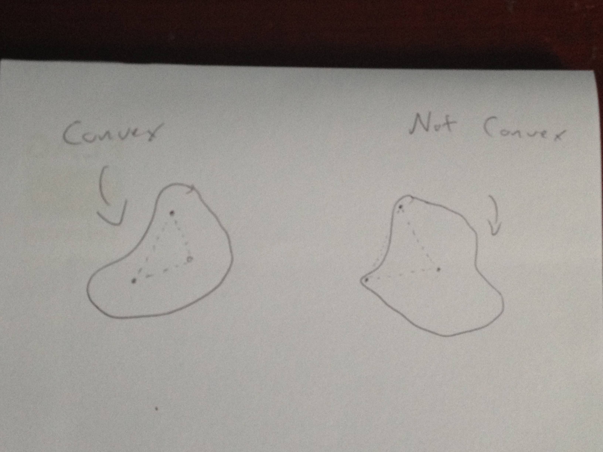

Convex
======

In Euclidean space, an object is convex if for every pair of points within the object, every point on the straight line segment that joins the pair of points is also within the object.

